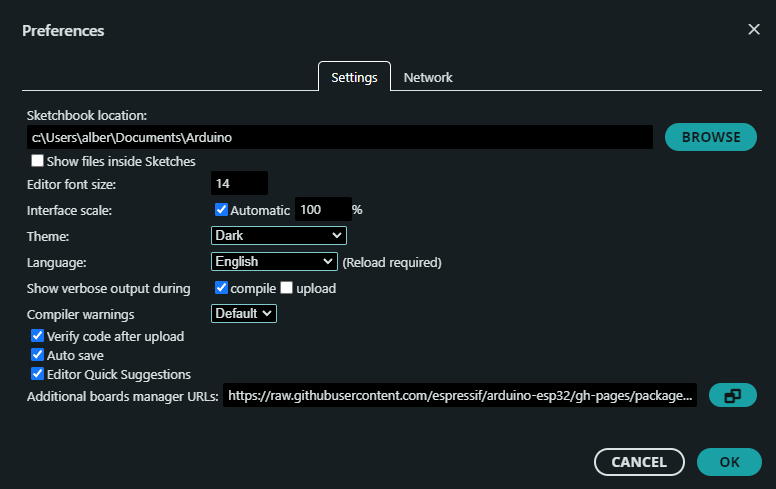

# Introduction
This document is oriented as a guide to install [micro-ROS2](https://micro.ros.org/) in [Wave Rover](https://www.waveshare.com/product/robotics/mobile-robots/raspberry-pi-robots/wave-rover.htm?sku=25377) Onboard ESP32 Module.

* ROS2 version (LTS): Jazzy Jalisco (GitHub)[https://docs.ros.org/en/foxy/Releases/Release-Jazzy-Jalisco.html]
* Micro ROS version: (GitHub)[https://github.com/micro-ROS/] 

There are two methods based on the development platform: 
* Method 1: Visual Studio Code + PlatformIO Extension
* Method 2: Arduino IDE

## Method 1: Visual Studio Code + PlatformIO Extension

1. Install (PlatformIO)[https://platformio.org/] Extension in VSC. If correctlyl installed, icon appears on the left column
2. Install ESP-IDF Extension in VSC. If correctlyl installed, icon appears on the left column (VSC Activity bar)
   2.1. The first time using ESP-IDF, a configuration procedure will appear. Tested method: 

## Method 2: Arduino IDE

### Step 1: Install ESP32 Add-on in Arduino IDE 

1. Install [Arduino IDE](https://www.arduino.cc/en/software)
2. Install ESP32 Add-on in Arduino IDE
   1. Arduino IDE, go to *File -> Preferences*
   2. Enter the following board manager into the *Additional Board Manager URLs* field: *https://raw.githubusercontent.com/espressif/arduino-esp32/gh-pages/package_esp32_index.json* 
   3. Open Boards Manager. Go to Tools -> Board -> Boards Manager…
   4. Search for ESP32 and select esp32 by Espressif Systems  

#### Testing installation

1. Plug the ESP32 board to computer. 
2. Open Arduino IDE 
3. Select Board in Tools > Board menu (in my case it’s the ESP32 DEV Module)

2. Install micro-ROS for Arduino from [GitHub](https://github.com/micro-ROS/micro_ros_arduino)
   1. Check the branch corresponding to the selected ROS2 distribution (in this case, Jazzy Jalisco -> micro-ROS Arduino branch Jazzy)
   2. [Download the repository](https://github.com/micro-ROS/micro_ros_arduino/archive/refs/heads/jazzy.zip)
   3. Open Arduino IDE

### Step 2: Install microROS in ESP32 
1. Create a new Sketch (to have an empty sketch and starting from scratch)
2. Ensure the connection with the ESP32 board
3. In top menu: *Sketch->Include Library->Add .ZIP library...*
4. Search for downloaded library (micro_ros_arduino-jazzy.zip for the test case)
5. Whait for installation. In Output window: "Library installed" when successfuly installed

#List of used resources
* https://www.youtube.com/watch?v=qtVFsgTG3AA
* https://randomnerdtutorials.com/installing-the-esp32-board-in-arduino-ide-windows-instructions/
